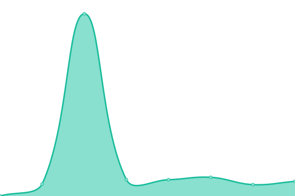
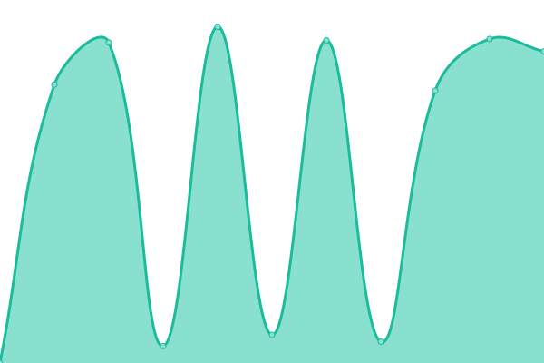
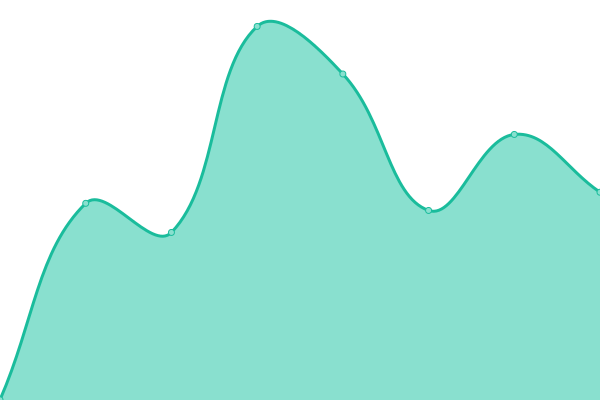

# [📈 Live Status](https://CapellaWS.github.io/upptime): <!--live status--> **🟩 All systems operational**

This repository contains the open-source uptime monitor and status page for [Capella Workplace Solutions Limited](https://CapellaWS.github.io/upptime), powered by [Upptime](https://github.com/upptime/upptime).

With [Upptime](https://upptime.js.org), you can get your own unlimited and free uptime monitor and status page, powered entirely by a GitHub repository. We use [Issues](https://github.com/CapellaWS/upptime/issues) as incident reports, [Actions](https://github.com/CapellaWS/upptime/actions) as uptime monitors, and [Pages](https://CapellaWS.github.io/upptime) for the status page.

<!--start: status pages-->
<!-- This summary is generated by Upptime (https://github.com/upptime/upptime) -->
<!-- Do not edit this manually, your changes will be overwritten -->
<!-- prettier-ignore -->
| URL | Status | History | Response Time | Uptime |
| --- | ------ | ------- | ------------- | ------ |
|  [Platform Hybrid Working](https://hybrid.capella-ws.com) | 🟩 Up | [platform-hybrid-working.yml](https://github.com/CapellaWS/UppTime/commits/HEAD/history/platform-hybrid-working.yml) | 

 566ms
     
 | 

<a href="https://CapellaWS.github.io/upptime/history/platform-hybrid-working">100.00%</a>
    

|  [Domus](https://portal.capella.ie) | 🟩 Up | [domus.yml](https://github.com/CapellaWS/UppTime/commits/HEAD/history/domus.yml) | 

 668ms
     
 | 

<a href="https://CapellaWS.github.io/upptime/history/domus">100.00%</a>
    

|  [Website-com](https://capella-ws.com) | 🟩 Up | [website-com.yml](https://github.com/CapellaWS/UppTime/commits/HEAD/history/website-com.yml) | 

 1542ms
     
 | 

<a href="https://CapellaWS.github.io/upptime/history/website-com">99.50%</a>
    

|  [Website-ie](https://capella.ie) | 🟩 Up | [website-ie.yml](https://github.com/CapellaWS/UppTime/commits/HEAD/history/website-ie.yml) | 

 1684ms
     
 | 

<a href="https://CapellaWS.github.io/upptime/history/website-ie">99.23%</a>
    

<!--end: status pages-->

[**Visit our status website →**](https://CapellaWS.github.io/upptime)

## 📄 License

- Powered by: [Upptime](https://github.com/upptime/upptime)
- Code: [MIT](./LICENSE) © [Capella Workplace Solutions Limited](https://CapellaWS.github.io/upptime)
- Data in the `./history` directory: [Open Database License](https://opendatacommons.org/licenses/odbl/1-0/)
